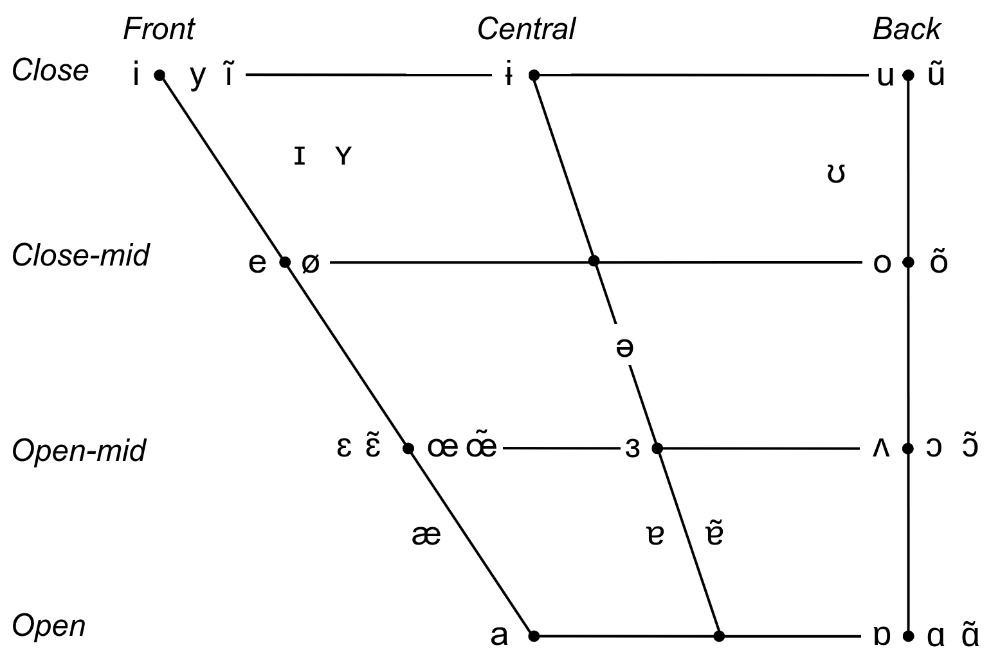

## 1. Phoneme inventory

BabAR predicts phonemes from a cross-linguistic inventory covering five languages: English, French, Portuguese, German, and Spanish. This means the model uses a shared set of IPA symbols rather than a language-specific one.
The full inventory is defined in `weights/vocab-phoneme-tinyvox.json`.

### 1.2 Vowel inventory

  

### 1.3 Consonant inventory

| Consonant | Place of articulation | Example | Languages |
|:---------:|----------------------|---------|-----------|
| m | labial               | **m**an | eng, deu, fra, spa, por |
| p | labial               | **p**en | eng, deu, fra, spa, por |
| b | labial               | **b**ad | eng, deu, fra, spa, por |
| f | labial               | **f**un | eng, deu, fra, spa, por |
| v | labial               | **v**an | eng, deu, fra, por |
| w | labial               | **w**in | eng, deu, fra |
| ɥ | labial               | **h**uit | fra |
| n | coronal              | **n**o | eng, deu, fra, spa, por |
| t | coronal              | **t**op | eng, deu, fra, spa, por |
| d | coronal              | **d**og | eng, deu, fra, spa, por |
| θ | coronal              | **th**ink | eng, spa |
| ð | coronal              | **th**is | eng |
| s | coronal              | **s**ee | eng, deu, fra, spa, por |
| z | coronal              | **z**oo | eng, deu, fra, por |
| ʃ | coronal              | **sh**ip | eng, deu, fra, por |
| ʒ | coronal              | mea**s**ure | eng, fra, por |
| l | coronal              | **l**ip | eng, deu, fra, spa, por |
| ɹ | coronal              | **r**ed | eng |
| r | coronal              | pe**r**o | deu, spa, por |
| ɾ | coronal              | be**tt**er | spa, por, eng |
| ɲ | dorsal               | a**ñ**o | fra, spa, por |
| j | dorsal               | **y**es | eng, deu, fra, spa, por |
| ç | dorsal               | i**ch** | deu |
| ʎ | dorsal               | ca**ll**e | spa, por |
| ŋ | dorsal               | si**ng** | eng, deu |
| k | dorsal               | **k**it | eng, deu, fra, spa, por |
| ɡ | dorsal               | **g**et | eng, deu, fra, spa, por |
| x | dorsal               | ba**ch** | deu, spa |
| ʁ | dorsal               | **r**ouge | deu, fra |
| h | laryngeal            | **h**at | eng, deu |